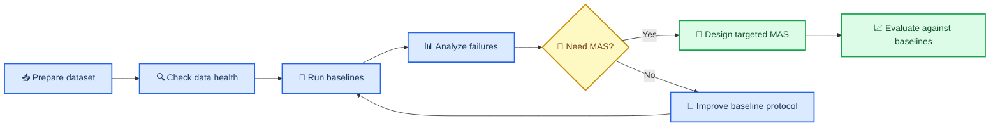

# AutoEmpirical

_A dataset-first reproduction project for evaluating automated empirical software fault analysis._

AutoEmpirical aims to build a clean, reusable benchmark for studying whether LLMs and later multi-agent systems can reproduce key parts of empirical software fault studies. The current repository state is intentionally dataset-first: the dataset is frozen and documented before new MAS design begins.

---

## 📋 Project overview

Empirical software fault studies usually involve three labor-intensive steps: collecting candidate bug records, filtering records into a study-specific valid bug set, and manually assigning taxonomy labels such as symptom and root cause. This project organizes those steps into a unified three-stage dataset so automated methods can be evaluated against human empirical-study workflows.

The current project scope is:

- Build a cross-paper dataset from empirical software engineering bug studies
- Preserve the human workflow stages as separate machine-readable tables
- Run reproducible baselines before proposing any new MAS design
- Use baseline failures to motivate later agentic improvements

The project is related to AutoEmpirical, an LLM-based automated research pipeline for empirical software fault analysis.[^1]

---

## 🎯 Research logic

The project should proceed in this order:



The important methodological constraint is that MAS design should not come first. A new MAS should only be proposed after simpler empirical-study baselines have been run and their concrete failure modes are known.

---

## 📊 Dataset

The dataset contains 7 retained empirical software fault studies and three workflow stages.

| Stage | File | Meaning | Rows |
| --- | --- | --- | ---: |
| Stage 1 Raw | `data/stage1.csv` | Raw candidate records before human filtering | 33,822 |
| Stage 2 Filtered | `data/stage2.csv` | Human-filtered bug-relevant records | 4,199 |
| Stage 3 Annotated | `data/stage3.csv` | Final human-labeled records | 2,050 |

The intended experimental tasks are:

| Task | Input | Gold target | Purpose |
| --- | --- | --- | --- |
| Stage 2 filtering | `data/stage1.csv` | membership in `data/stage2.csv` | Predict whether a candidate record should be accepted as bug-relevant |
| Stage 3 labeling | `data/stage2.csv` | labels in `data/stage3.csv` | Predict empirical-study labels such as `symptom`, `root_cause`, `bug_type`, `component`, and `fix_type` |

---

## 📚 Included studies

| Paper ID | Venue | Stage 1 | Stage 2 | Stage 3 |
| --- | --- | ---: | ---: | ---: |
| `ase2022_towards_understanding_the_faults_of` | ASE | 3,859 | 684 | 682 |
| `icse2021_iot_bugs_and_development_challenges` | ICSE | 5,565 | 323 | 320 |
| `issta2024_bugs_in_pods_understanding_bugs` | ISSTA | 8,271 | 429 | 429 |
| `icse2023_an_empirical_study_on_bugs` | ICSE | 2,205 | 194 | 194 |
| `icse2024_understanding_transaction_bugs_in_database` | ICSE | 7,775 | 140 | 140 |
| `fse2021_an_exploratory_study_of_autopilot` | FSE | 569 | 168 | 142 |
| `icse2022_an_empirical_study_on_performance` | ICSME | 5,578 | 2,261 | 143 |

Two earlier candidate studies were excluded because their Stage 1 to Stage 2 filtering rate was 0%, which made them unsuitable for the current filtering-task formulation. The retained studies are summarized in `metadata/paper_dataset_summary.csv` and `metadata/paper_dataset_overview.md`.

---

## 💾 Repository structure

```text
.
  README.md
  data/
    stage1.csv
    stage2.csv
    stage3.csv
    by_paper/
      <paper_id>/
        stage1.csv
        stage2.csv
        stage3.csv
  metadata/
    dataset_metadata.csv
    dataset_metadata.md
    paper_dataset_summary.csv
    paper_dataset_overview.md
    data_dictionary.md
    stage1_label_dictionary.md
    prompts.yaml
  reports/
    dataset_health_report.md
    data_quality_metrics.csv
    duplicate_key_rows.csv
    SHA256SUMS.txt
  research/
    baseline_research_plan.md
```

### Key files

| File | Purpose |
| --- | --- |
| `data/stage1.csv` | Unified raw candidate dataset |
| `data/stage2.csv` | Unified human-filtered dataset |
| `data/stage3.csv` | Unified final annotated dataset |
| `data/by_paper/<paper_id>/` | Per-paper stage splits for paper-level experiments |
| `metadata/dataset_metadata.csv` | Paper-level metadata, counts, paths, and notes |
| `metadata/data_dictionary.md` | Field definitions |
| `reports/dataset_health_report.md` | Human-readable data quality report |
| `reports/data_quality_metrics.csv` | Machine-readable quality metrics |
| `reports/duplicate_key_rows.csv` | Duplicate `record_id` and `issue_url` evidence |
| `research/baseline_research_plan.md` | Baseline-first experimental roadmap |

---

## 🔍 Data health

The latest health check was run on 2026-06-16.

| Stage | Schema OK | Papers | `record_id` unique | Duplicate `record_id` rows | `issue_url` unique | Duplicate `issue_url` rows | Final-label coverage |
| --- | --- | ---: | ---: | ---: | ---: | ---: | ---: |
| Stage 1 | yes | 7 | 33,799 / 33,822 | 23 | 33,749 / 33,822 | 73 | partial |
| Stage 2 | yes | 7 | 4,177 / 4,199 | 22 | 4,163 / 4,199 | 36 | partial |
| Stage 3 | yes | 7 | 2,042 / 2,050 | 8 | 2,032 / 2,050 | 18 | 100% |

Current interpretation:

- All three core CSV files are readable.
- All three files share the same 23-column schema.
- Stage 3 is ready as the gold-label table for label prediction experiments.
- Stage 1 and Stage 2 intentionally contain partial labels because they represent earlier human workflow stages.
- `record_id` and `issue_url` are not strict primary keys.

Practical rule for experiments: use paper-level splits or grouped `issue_url` splits. Row-level random splits can leak the same GitHub issue across train and test.

See `reports/dataset_health_report.md` for details.

---

## 🧪 Baseline plan

Before designing a new MAS, run baselines in increasing complexity:

1. Majority and heuristic baselines
2. TF-IDF plus logistic regression or linear SVM
3. Single-LLM zero-shot baseline
4. Single-LLM few-shot baseline
5. Self-consistency or majority-vote LLM baseline
6. Retrieval-augmented single-LLM baseline

The baseline protocol should report:

- macro-F1 and micro-F1
- per-paper performance
- invalid-output rate
- uncertainty or abstention rate
- cost per 100 records
- sampled failure-mode categories

The main research question for this phase is not "can MAS work?" It is "what do simpler empirical-study baselines fail to do on this dataset?"

See `research/baseline_research_plan.md`.

---

## ⚙️ Quick start

Install minimal analysis dependencies:

```powershell
python -m pip install pandas scikit-learn pyyaml
```

Verify the dataset loads:

```powershell
python - <<'PY'
import pandas as pd

for stage in ["stage1", "stage2", "stage3"]:
    df = pd.read_csv(f"data/{stage}.csv")
    print(stage, df.shape, df["paper_id"].nunique())
PY
```

Expected output:

```text
stage1 (33822, 23) 7
stage2 (4199, 23) 7
stage3 (2050, 23) 7
```

Recommended first implementation target:

```text
scripts/run_baseline.py
  --task stage2_filter
  --task stage3_label
  --split leave_one_paper_out
  --split grouped_issue_url
```

---

## 📈 Project progress

| Area | Status | Notes |
| --- | --- | --- |
| Dataset consolidation | Complete | Three-stage dataset and per-paper splits are present |
| Metadata | Complete | Paper-level metadata and data dictionary are present |
| Health check | Complete | Latest report is under `reports/` |
| Baseline plan | Ready | Baseline sequence is documented under `research/` |
| Baseline implementation | Not started | Next engineering step |
| MAS redesign | Blocked by baselines | Should wait for measured baseline failures |
| Paper argument | In progress | Contribution logic depends on baseline results |

---

## 🔧 Future work

Near-term:

- Implement deterministic dataset loading utilities.
- Implement Stage 2 filtering baselines.
- Implement Stage 3 labeling baselines.
- Add grouped split utilities to avoid issue-level leakage.
- Produce baseline result tables and error-analysis reports.

Medium-term:

- Normalize taxonomy values where cross-paper labels have spelling or granularity differences.
- Add strict evaluation scripts for per-field metrics.
- Build a sampled qualitative error set for baseline failure analysis.
- Decide whether duplicate records should be preserved or consolidated for each experiment type.

Later:

- Design a new MAS only after baseline failures are documented.
- Tie each MAS component to a measured baseline limitation.
- Evaluate the new MAS against the baseline suite under the same splits, models, and cost accounting.

---

## 📌 Notes for maintainers

- Keep this repository dataset-first and baseline-first.
- Do not migrate old forked data-processing code unless it is required for reproducibility.
- Do not continue the previous MAS v2 design as the default next step.
- Preserve `reports/SHA256SUMS.txt` or regenerate it whenever dataset files change.
- Treat duplicate keys as an explicit experimental-design issue, not as a hidden cleanup task.

---

## 🔗 References

[^1]: Yu, Y. et al. (2025). "AutoEmpirical: LLM-based automated research for empirical software fault analysis." Local project attachment and public PDF search result: https://ttfish.cc/content/Papers/ICSE26-AutoEmpirical.pdf
